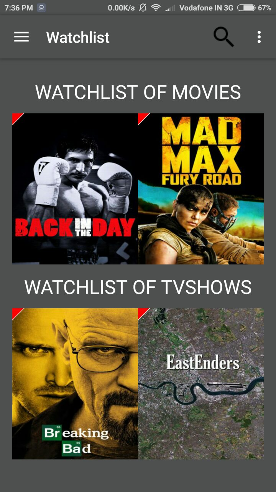
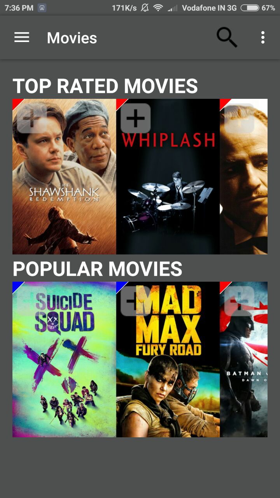
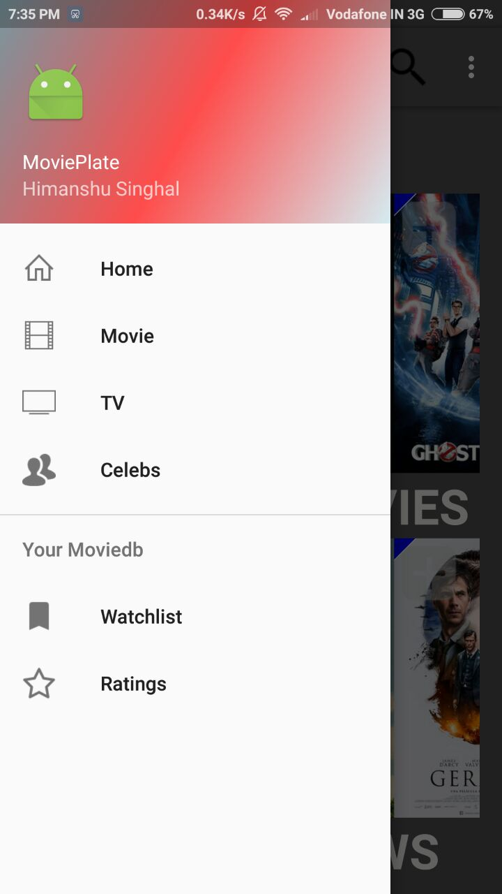
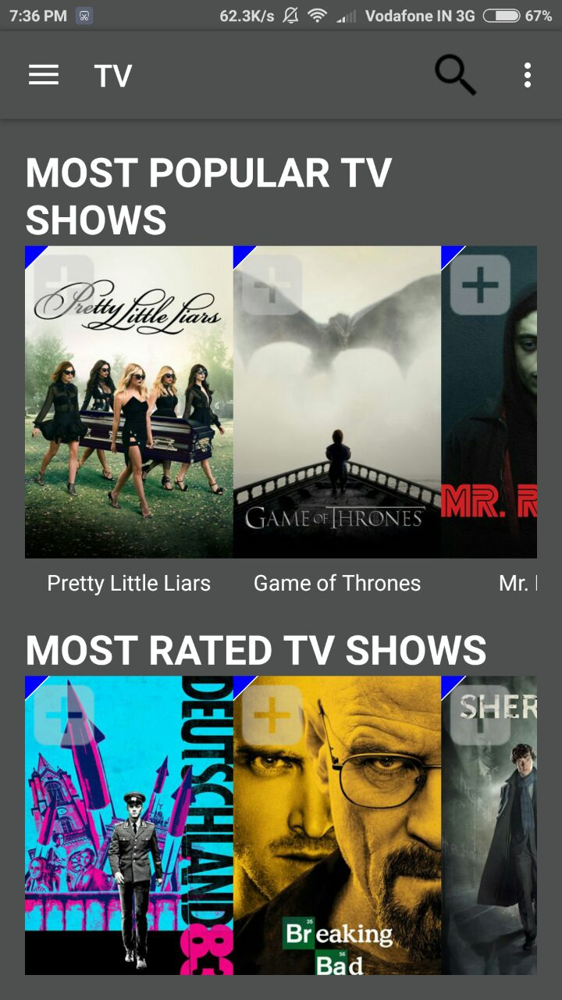
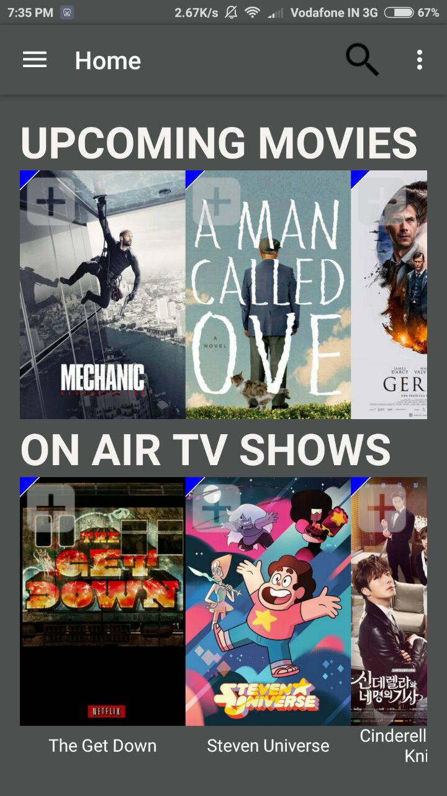
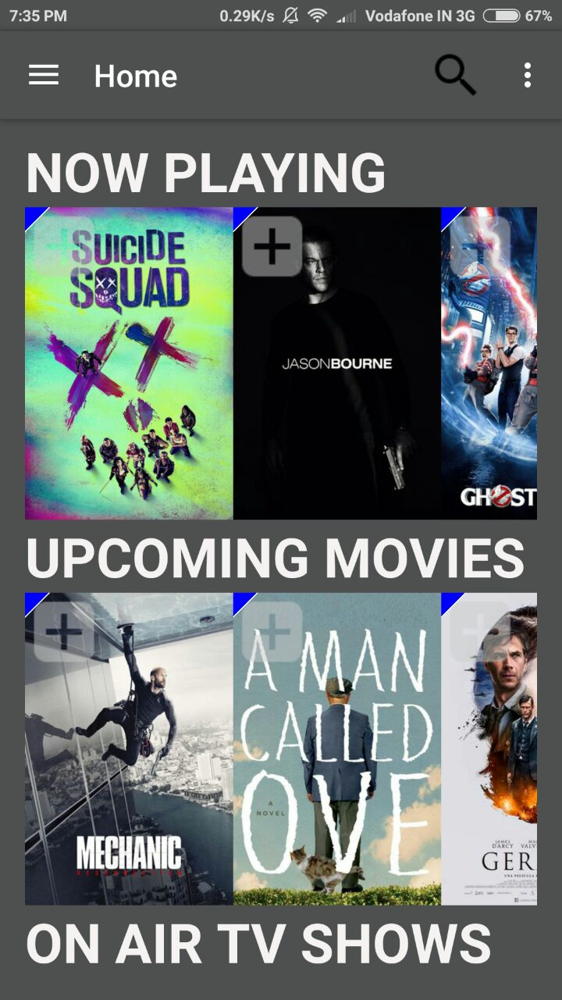
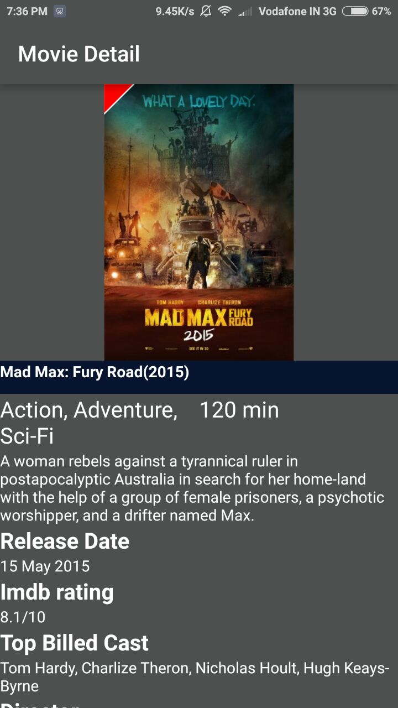
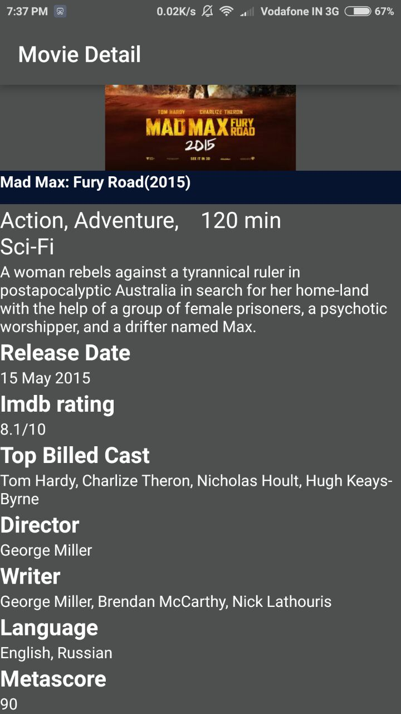
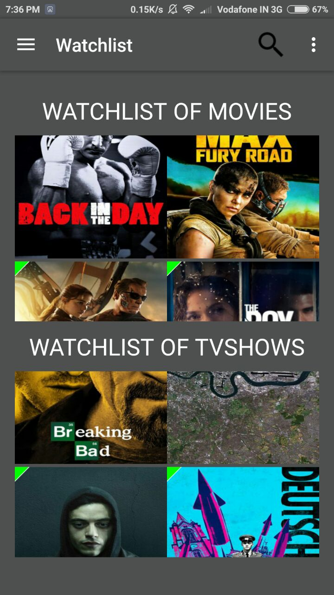
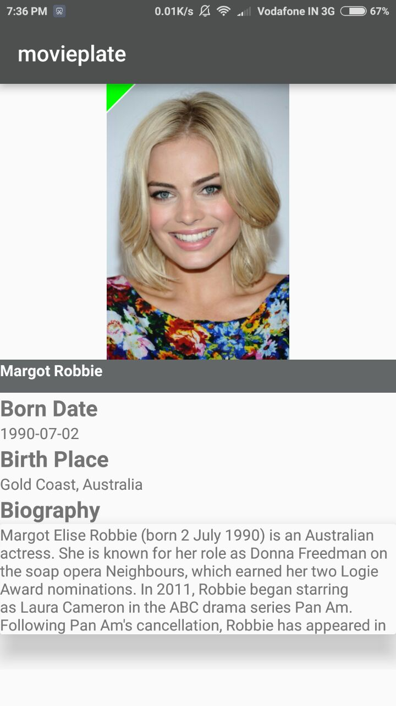

# movieplate
It is an android app to let you browse popular, rated &amp; now playing movies &amp; TV shows. Also, it allows you to add TV shows or movies to your watchlist &amp; see your watchlist. This app is built using MovieDB &amp; OMDB APIs.
 
###Screenshots:

  &nbsp;
  &nbsp;
  

  &nbsp;
  &nbsp;
  

  &nbsp;
  &nbsp;
  

  &nbsp;
  

